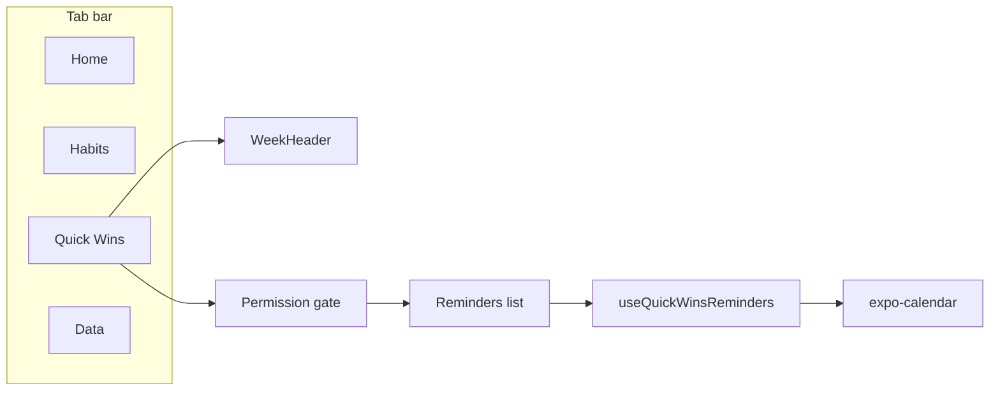

# Quick Wins: iOS Reminders integration

## Scope

- New tab **Quick Wins** in the tab bar.
- **iOS only**: Reminder APIs are iOS-only in expo-calendar. On Android/Web, show an "Available on iOS" (or similar) message and optionally hide the tab or show the tab with that message.
- **Permission**: Request Reminders access; if denied, show a prompt to grant permission (no list data).
- **Data**: Show only reminders that have a date (due date and/or completion date). Display reminders that are (1) due on or before the selected date, or (2) completed on the selected date.

## Architecture

## 1. Dependency and config

- **Add** `expo-calendar`: `npx expo install expo-calendar`.
- **Configure** [app.json](app.json): Add the `expo-calendar` plugin with `remindersPermission` (e.g. "Meritable uses reminders to show Quick Wins for the selected day."). No need for `calendarPermission` if the app only reads reminders.

## 2. New route and tab

- **New route**: `app/(tabs)/quick-wins/index.tsx` — Quick Wins screen (WeekHeader + content).
- **Tab layout**: In [app/(tabs)/_layout.tsx](app/(tabs)/_layout.tsx), add a `Tabs.Screen` for `quick-wins` with title "Quick Wins" and an appropriate icon (e.g. `checkmark-done` or `flash` from Ionicons). Match existing tab options (active/inactive colors, etc.).
- **Platform**: Use `Platform.OS === 'ios'` to show the Quick Wins tab only on iOS, or show the tab on all platforms and render "Available on iOS" content on non‑iOS (recommended so the tab is always visible; non‑iOS users see a short explanation).

## 3. Reminders data layer (no new DB implementation)

- **Hook module** [db/useReminders.ts](db/useReminders.ts): Thin wrapper around expo-calendar for reminders only.
  - **Permission**: Use `Calendar.getRemindersPermissionsAsync()` and `Calendar.requestRemindersPermissionsAsync()` (or `useRemindersPermissions()` from expo-calendar). Expose a small hook or helper so the Quick Wins screen can request and check permission.
  - **Fetch reminders for a date**:
    - Call `Calendar.getCalendarsAsync(Calendar.EntityTypes.REMINDER)` to get reminder calendar IDs.
    - Call `Calendar.getRemindersAsync(calendarIds, null, startDate, endDate)`. expo-calendar returns reminders that overlap the interval: "all reminders that end after the startDate or begin before the endDate". Use a range that includes the selected day and past due (e.g. startDate = epoch or "long ago", endDate = end of selected day) so you get both "due by selected date" and "completed on selected date" in one or two fetches. If the API allows filtering by completion status, you can call once with `status: null` to get all, then filter in JS.
  - **Filter in JS**:
    - Keep only reminders that have at least one date (due date and/or completion date — use the actual Reminder type fields from expo-calendar once installed).
    - Include a reminder if: (due date is set and due date <= selectedDate) OR (completed and completion date === selectedDate). Normalize dates to YYYY-MM-DD using [lib/dateUtils.ts](lib/dateUtils.ts) for comparison.
  - **Date range helpers**: Add to [lib/dateUtils.ts](lib/dateUtils.ts) (or in [db/useReminders.ts](db/useReminders.ts)) helpers that return `Date` objects for "start of day" and "end of day" for a given YYYY-MM-DD string, for use in `getRemindersAsync(startDate, endDate)`.

## 4. Quick Wins screen UI (mirror habits index)

- **Layout** (same structure as [app/(tabs)/habits/index.tsx](app/(tabs)/habits/index.tsx)):
  - **WeekHeader**: Reuse [components/WeekHeader.tsx](components/WeekHeader.tsx) with `selectedDate` and `onDateSelect` (local state for selected date).
  - **Content**:
    - If not iOS: render a short message (e.g. "Quick Wins is available on iOS.") inside [components/NarrowView.tsx](components/NarrowView.tsx).
    - If iOS: check permission. If not granted, show a prompt (text + button to request permission). If denied after request, show "Reminders access was denied" and optional link to Settings.
    - If granted: show a list of filtered reminders for `selectedDate` (see below).
  - **Refreshing**: On iOS, when app comes to foreground (AppState), refetch reminders (same pattern as habits index with `queryClient.invalidateQueries()` if using React Query, or a simple refetch in the reminders hook).
  - Reuse **NarrowView**, **Spinner** from [components/](components/). No edit/reorder mode or Add button for Quick Wins.
- **List of reminders**: New component (e.g. `components/QuickWinsList.tsx` or `RemindersList.tsx`):
  - Receives `reminders: Reminder[]` (expo-calendar Reminder type) and optionally `selectedDate`.
  - Renders a vertical list of rows. Each row: reminder title; optional subtitle (e.g. due date or "Completed"); optional completed state (e.g. strikethrough or icon). Styling consistent with [components/HabitCompletionButton.tsx](components/HabitCompletionButton.tsx) (card background, [lib/Colors.ts](lib/Colors.ts)), but no completion toggle — read-only from Reminders. Optional: deep link to Reminders app for that reminder if expo-calendar or Linking supports it; otherwise omit.

## 5. React Query (optional but recommended)

- In [db/useReminders.ts](db/useReminders.ts): use a query key like `['quickWinsReminders', selectedDate]` and a hook `useQuickWinsReminders(selectedDate)` that:
  - Runs only on iOS and when permission is granted.
  - Calls the reminders fetch + filter logic and returns `{ data: filteredReminders, isLoading, refetch }`.
- Invalidating this query when app comes to foreground keeps the list in sync with Reminders.

## 6. Cursor rules and docs

- Update [.cursor/rules/app-routes.mdc](.cursor/rules/app-routes.mdc): Add `(tabs)/quick-wins/index.tsx` to the route tree and note that Quick Wins is iOS-only.
- Update [.cursor/rules/db-layer.mdc](.cursor/rules/db-layer.mdc): Add `useReminders.ts` to the file list (React hooks for iOS Reminders via expo-calendar; permission + fetch + filter). Add a short note that reminders are read-only and not part of `HabitDatabaseInterface`; Quick Wins UI uses `useReminders.ts` / `useQuickWinsReminders()`.

## 7. Testing and edge cases

- **No reminders / no date**: Reminders without any date are excluded by the filter.
- **Permission denied**: User sees clear message and no list.
- **Empty list**: Show an empty state (e.g. "No dated reminders for this day") instead of a blank area.
- **Date boundary**: Ensure "due on or before selectedDate" and "completed on selectedDate" use the same timezone/day logic as the rest of the app (YYYY-MM-DD in local time via dateUtils).

## Key files to add or touch

| Action | File                                                                               |
| ------ | ---------------------------------------------------------------------------------- |
| Add    | `app/(tabs)/quick-wins/index.tsx` — Quick Wins screen                              |
| Edit   | `app/(tabs)/_layout.tsx` — New tab for Quick Wins                                  |
| Add    | `db/useReminders.ts` — Permission + fetch + filter (hooks)                         |
| Add    | `components/QuickWinsList.tsx` (or `RemindersList.tsx`) — List UI                  |
| Edit   | `app.json` — expo-calendar plugin with remindersPermission                         |
| Edit   | `lib/dateUtils.ts` — Optional: startOfDay/endOfDay for Date range                  |
| Edit   | `.cursor/rules/app-routes.mdc` — Document quick-wins route                         |
| Edit   | `.cursor/rules/db-layer.mdc` — Add useReminders.ts to file list and reminders note |

## Implementation notes

- **Reminder type**: After adding expo-calendar, import the `Reminder` type and use its actual fields (e.g. `dueDate`, `completionDate`, `status`) for filtering and display. The exact property names may be ISO date strings or Date-like; normalize to YYYY-MM-DD for comparison with `selectedDate`.
- **getRemindersAsync**: If a single call with a wide range returns too many items, consider narrowing the range or pagination; for a single day view, a range from "start of selected date" to "end of selected date" plus a separate range for "past due" might be needed depending on API behavior. The plan assumes one or two fetches and client-side filter.

