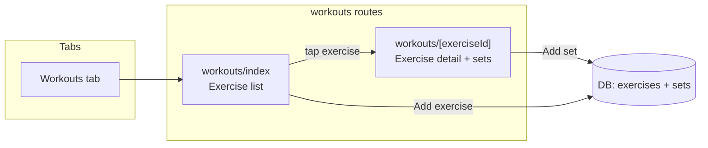

# Workouts feature: Exercises and Sets

## Data model

- **Exercise**: `id`, `name`, `order` (for list ordering), `created_at` / `updated_at` (optional, consistent with habits).
- **Set**: `id`, `exerciseId`, `weight` (number or `null`), `reps` (number), `**completionDate`** (string, ISO date only, e.g. `"2025-02-22"` — same as [db/habitDatabase.ts](db/habitDatabase.ts) line 16 for HabitCompletion), `created_at` (for ordering/display). Weight is always in lbs.

## Architecture




- New **tab**: Workouts → `app/(tabs)/workouts/` (stack with `index` and `[exerciseId]`).
- **List screen**: List exercises; tap row → exercise detail; add exercise via text input + button (same pattern as [components/HabitInputForm.tsx](components/HabitInputForm.tsx)).
- **Detail screen**: Exercise name at top; "Add set" form (weight optional, reps required; numeric inputs); at bottom, a simple **history** list of sets (e.g. "45 lbs × 10" or "10 reps" when weight is null, plus date if desired). When adding a set, set **completionDate** to the selected date (e.g. today via `getToday()`) in addition to `created_at`.

## 1. Database layer

**File: [db/habitDatabase.ts](db/habitDatabase.ts)**

Add the following after the existing types and before the class (e.g. after `HabitCompletionInput`):

```ts
// Exercise & Set (workouts)
export type Exercise = AutoGeneratedFields & {
  name: string;
  order: number;
}

export type Set = AutoGeneratedFields & {
  exerciseId: number;
  weight: number | null;
  reps: number;
  completionDate: string; // ISO date only, e.g. "2025-02-22"
}

export type ExerciseInput = Omit<Exercise, keyof AutoGeneratedFields>;
export type SetInput = Omit<Set, keyof AutoGeneratedFields>;
```

Extend `HabitDatabaseInterface` with these abstract methods (add before the closing `}` of the class):

```ts
  // Exercise operations
  abstract createExercise(exercise: { name: string }): Promise<Exercise>
  abstract getExercises(): Promise<Exercise[]>
  abstract updateExercise(id: number, updates: Partial<ExerciseInput>): Promise<Exercise>
  abstract deleteExercise(id: number): Promise<void>

  // Set operations
  abstract createSet(set: SetInput): Promise<Set>
  abstract getSetsByExerciseId(exerciseId: number): Promise<Set[]>
  abstract deleteSet(id: number): Promise<void>
```

**Implementations**

- **[db/dexieDb.ts](db/dexieDb.ts)**: Add tables `exercises` and `sets`. Add **version(2)** with new stores (`exercises: '++id'`, `sets: '++id, exerciseId, completionDate'`). Implement the new interface methods; persist **completionDate** on each set.
- **[db/asyncStorageDb.ts](db/asyncStorageDb.ts)**: New keys (e.g. `EXERCISES_KEY`, `SETS_KEY`); load/save JSON arrays; implement same methods; each set includes **completionDate**.
- **[db/supabaseDb.ts](db/supabaseDb.ts)**: New tables `exercises` (e.g. `id`, `user_id`, `name`, `order`, `created_at`, `updated_at`) and `sets` (`id`, `user_id`, `exercise_id`, `weight` nullable, `reps`, `completion_date`, `created_at`). All queries scoped by `user_id`. Create these tables in the Supabase dashboard (or via SQL migration) and implement the interface methods.

**Mocks**: Update [db/**mocks**/dexieDbMock.ts](db/__mocks__/dexieDbMock.ts), [db/**mocks**/asyncStorageDbMock.ts](db/__mocks__/asyncStorageDbMock.ts), [db/**mocks**/supabaseDbMock.ts](db/__mocks__/supabaseDbMock.ts) with the new methods (e.g. return empty arrays / resolved promises).

## 2. React Query hooks

**New file: `db/useWorkoutDb.ts`**

- Same pattern as [db/useHabitDb.ts](db/useHabitDb.ts): use `useDataSource()` for `activeDb`, React Query for cache.
- Query keys: e.g. `EXERCISES_QUERY_KEY`, `SETS_QUERY_KEY` (with `exerciseId` for sets).
- Hooks: `useListExercises`, `useCreateExercise`, `useDeleteExercise` (and `useUpdateExercise` if needed); `useListSetsByExerciseId(exerciseId)`, `useCreateSet` (payload includes **completionDate**; invalidate sets list by `exerciseId` on success).

## 3. Routes and layouts

- **[app/(tabs)/_layout.tsx](app/(tabs)/_layout.tsx)**: Add a `Tabs.Screen` for `workouts` (e.g. title "Workouts", icon such as `barbell` or `fitness` from Ionicons), `href: '/workouts'`.
- **app/(tabs)/workouts/_layout.tsx**: New stack with `Stack.Screen name="index"` and `Stack.Screen name="[exerciseId]"` (same pattern as [app/(tabs)/habits/_layout.tsx](app/(tabs)/habits/_layout.tsx)).
- **app/(tabs)/workouts/index.tsx**: Workouts list screen: use `useListExercises()`; render list of exercises (each row tappable with `router.push(\`/workouts/${exercise.id})`); add-exercise form (TextInput + button using` useCreateExercise()`). Use` NarrowView` and existing styling (e.g. [lib/Colors.ts](lib/Colors.ts)).
- **app/(tabs)/workouts/[exerciseId].tsx**: Exercise detail: `useLocalSearchParams()` for `exerciseId`; resolve exercise from `useListExercises()`; show exercise name (and back navigation); "Add set" form (weight optional, reps required; numeric inputs); when submitting, set **completionDate** to today (e.g. `getToday()` from [lib/dateUtils](lib/dateUtils)) in addition to backend-set `created_at`; at bottom, list sets from `useListSetsByExerciseId(exerciseId)` (e.g. "45 lbs × 10" or "10 reps", optionally with completionDate). Use `NarrowView` and same styling patterns.

## 4. Components (minimal)

- Keep UI in the route files initially, or extract only if it keeps the code clear:
  - **Exercise list row**: Pressable row showing exercise name, `onPress` → `router.push(\`/workouts/${exercise.id})`.
  - **Add exercise**: Inline in `workouts/index.tsx` (TextInput + "Add" button), or a small `ExerciseInputForm` in `components/` if you prefer reuse.
  - **Add set form**: In `workouts/[exerciseId].tsx`: two inputs (weight optional, reps required), submit → `createSet({ exerciseId, weight: valueOrNull, reps, completionDate: getToday() })`. Use `keyboardType="numeric"` or `"decimal-pad"` for weight/reps.
  - **Set history**: Simple list (e.g. `FlatList` or `map`) of set rows (e.g. weight + "×" + reps, or "Reps: N" when no weight; optionally show completionDate).

No new dependencies; follow NativeWind and existing theme (Colors, ThemedText/ThemedView if used elsewhere).

## 5. Supabase tables (manual or migration)

Run the following SQL in the Supabase SQL Editor (Dashboard → SQL Editor). Uses integer/bigint ids to align with Dexie/AsyncStorage and existing habits usage in the app.

```sql
-- Exercises table
create table if not exists public.exercises (
  id bigint generated by default as identity primary key,
  user_id uuid not null references auth.users(id) on delete cascade,
  name text not null,
  "order" int not null default 0,
  created_at timestamptz default now(),
  updated_at timestamptz default now()
);

-- Sets table
create table if not exists public.sets (
  id bigint generated by default as identity primary key,
  user_id uuid not null references auth.users(id) on delete cascade,
  exercise_id bigint not null references public.exercises(id) on delete cascade,
  weight numeric null,
  reps int not null,
  completion_date date not null,
  created_at timestamptz default now()
);

-- RLS: exercises
alter table public.exercises enable row level security;

create policy "Users can CRUD own exercises"
  on public.exercises
  for all
  using (auth.uid() = user_id)
  with check (auth.uid() = user_id);

-- RLS: sets
alter table public.sets enable row level security;

create policy "Users can CRUD own sets"
  on public.sets
  for all
  using (auth.uid() = user_id)
  with check (auth.uid() = user_id);

-- Optional: index for listing sets by exercise
create index if not exists sets_exercise_id_idx on public.sets (exercise_id);
create index if not exists sets_completion_date_idx on public.sets (completion_date);
```

**Note:** App types use `id: number` and `exerciseId`; Supabase columns are `id`, `exercise_id`, `completion_date`. Map these in [db/supabaseDb.ts](db/supabaseDb.ts) when reading/writing (e.g. `exercise_id` ↔ `exerciseId`, `completion_date` ↔ `completionDate`).

## Summary


| Area              | Action                                                                                                                         |
| ----------------- | ------------------------------------------------------------------------------------------------------------------------------ |
| Types & interface | [db/habitDatabase.ts](db/habitDatabase.ts): Exercise, Set (with **completionDate**), and new methods                           |
| Implementations   | [db/dexieDb.ts](db/dexieDb.ts) (v2 stores), [db/asyncStorageDb.ts](db/asyncStorageDb.ts), [db/supabaseDb.ts](db/supabaseDb.ts) |
| Hooks             | New `db/useWorkoutDb.ts`                                                                                                       |
| Tab + routes      | New `workouts` tab; `workouts/_layout.tsx`, `workouts/index.tsx`, `workouts/[exerciseId].tsx`                                  |
| UI                | List + add exercise; detail + add set form (with completionDate) + set history list                                            |
| Mocks             | Add new methods to existing db mocks                                                                                           |
| Supabase          | Create `exercises` and `sets` tables (including **completion_date** on sets) and RLS                                           |


Implementation order: database types and interface → all three DB implementations and mocks → hooks → routes and layouts → list and detail screens with inline or small components.